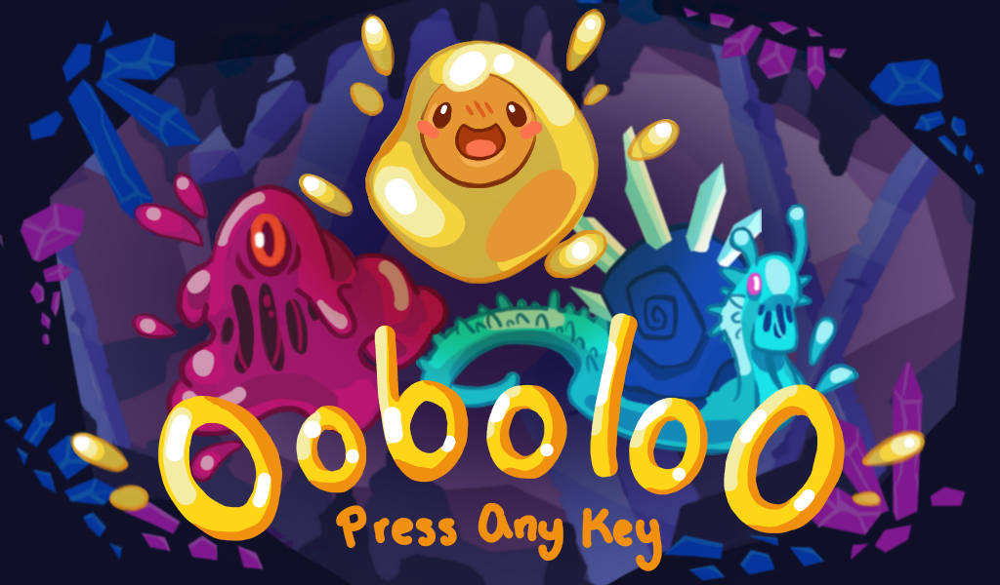

# OoboloO

_**[Live demo](https://levilindsey.github.io/global-game-jam-2021/build/global-game-jam-2021.html)**_

_[Gameplay trailer](https://www.youtube.com/watch?v=qNUtp4FSwaY&t=2s)_

_[Global Game Jam post](https://globalgamejam.org/2021/games/ooboloo-2)_

We made this game for Global Game Jam 2021. The theme was "lost and found".

Our team of four made all art, sounds, music, and code within 48 hours.

This was made by:
-   Connie Wan
-   Daisy Muradyan
-   Levi Lindsey
-   Zaven Muradyan

## Software used

-   Game engine: [Godot](https://godotengine.org/).

## Licenses

-   The code is published under the [MIT license](LICENSE).
-   The art assets (images, sounds, and music) are published under the [CC0 1.0 Universal license](https://creativecommons.org/publicdomain/zero/1.0/deed.en).
